# RAGify — Architecture Report

**Date:** 7 March 2026  
**Version:** 0.1.0  
**Author:** GitHub Copilot Architecture Review

---

## Table of Contents

1. [System Overview](#1-system-overview)
2. [High-Level Architecture Diagram](#2-high-level-architecture-diagram)
3. [Technology Stack](#3-technology-stack)
4. [Component Architecture](#4-component-architecture)
5. [Authentication & Authorization Flow](#5-authentication--authorization-flow)
6. [RAG Query Pipeline — Sequence Diagram](#6-rag-query-pipeline--sequence-diagram)
7. [Document Upload & Indexing Flow](#7-document-upload--indexing-flow)
8. [Data Model (Entity-Relationship Diagram)](#8-data-model-entity-relationship-diagram)
9. [API Surface Map](#9-api-surface-map)
10. [Infrastructure & Deployment Diagram](#10-infrastructure--deployment-diagram)
11. [Frontend Architecture](#11-frontend-architecture)
12. [Caching Architecture](#12-caching-architecture)
13. [Multi-Tenancy Design](#13-multi-tenancy-design)
14. [Data Flow: End-to-End Query](#14-data-flow-end-to-end-query)
15. [State Machine: Document Status](#15-state-machine-document-status)
16. [Key Design Decisions](#16-key-design-decisions)

---

## 1. System Overview

**RAGify** is a multi-tenant, production-ready SaaS platform that allows developers to build and deploy Retrieval-Augmented Generation (RAG) pipelines as managed REST API services.

**Core Value Proposition:**  
Upload your documents → Get a REST API endpoint → Query your documents in natural language with cited, grounded AI responses.

**Key Capabilities:**

| Capability | Description |
|---|---|
| Multi-tenancy | Full user/project isolation via denormalized `user_id`/`project_id` on every chunk |
| Hybrid Search | Vector (pgvector cosine) + Keyword (BM25 tsvector), fused with Reciprocal Rank Fusion |
| Query Expansion | LLM generates 3 query variations before retrieval to maximize recall |
| Reranking | Cohere cross-encoder reranking for precision improvement |
| Streaming | NDJSON streaming responses for low time-to-first-byte |
| Multi-provider LLM | OpenAI, Groq, Sarvam, DeepSeek, ZhipuAI — all via unified registry |
| Caching | Upstash Redis (30-min TTL) + in-memory LRU fallback |
| Observability | Langfuse LLM tracing for all pipeline stages |

---

## 2. High-Level Architecture Diagram

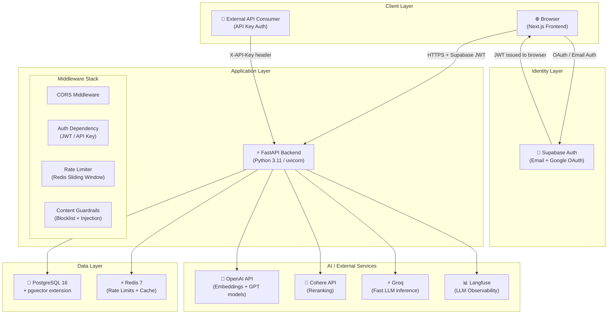

---

## 3. Technology Stack

### Backend

| Layer | Technology | Purpose |
|---|---|---|
| Web Framework | FastAPI 0.109 | Async API, OpenAPI docs, dependency injection |
| ASGI Server | Uvicorn | HTTP/1.1 + HTTP/2 async server |
| ORM | SQLAlchemy 2.x (async) | DB model definitions, async queries |
| Migrations | Alembic | Database schema versioning |
| DB Driver | asyncpg | Async PostgreSQL driver |
| Vector Store | pgvector 0.7+ | 1536-dim vector storage + cosine similarity |
| Embeddings | OpenAI `text-embedding-3-small` | 1536-dimension dense embeddings |
| LLM Orchestration | LangChain | Prompt templates, chains, streaming |
| Reranking | Cohere `rerank-v3.5` | Cross-encoder re-ranking |
| Cache | Redis (Upstash) | Query result cache, TTL-based |
| Rate Limiting | Redis (docker local) | Sliding window per user |
| Auth Verification | PyJWT | JWT decode + HS256/ES256 verification |
| Password Hashing | passlib + bcrypt | Secure password storage |
| Tracing | Langfuse | LLM pipeline observability |
| Document Parsing | pypdf, python-docx | PDF and DOCX text extraction |
| Text Splitting | LangChain `RecursiveCharacterTextSplitter` | Chunk generation |

### Frontend

| Layer | Technology | Purpose |
|---|---|---|
| Framework | Next.js 16 (App Router) | SSR/SSG, routing, layouts |
| UI Library | React 19 | Component model |
| Language | TypeScript | Type safety |
| Styling | Tailwind CSS v4 | Utility-first CSS |
| Components | Shadcn/UI (Radix primitives) | Accessible UI components |
| Icons | Lucide React | Icon library |
| HTTP Client | Axios | API communication with interceptors |
| Auth State | Zustand | Single global auth store |
| Server State | TanStack React Query | API data fetching/caching |
| Forms | react-hook-form + Zod | Form validation |
| Charts | Recharts | Analytics dashboard |
| Auth Provider | Supabase Auth (JS SDK) | Email + Google OAuth |

### Infrastructure

| Component | Technology | Notes |
|---|---|---|
| Database | PostgreSQL 16 (pgvector/pgvector:pg16 image) | Vector + relational in one |
| Cache/Rate Limit | Redis 7 Alpine | Local Docker |
| Cloud Cache | Upstash Redis | Serverless Redis for query cache |
| Container Runtime | Docker Compose | Local/dev orchestration |
| Auth Service | Supabase | Managed auth (email, Google OAuth) |

---

## 4. Component Architecture

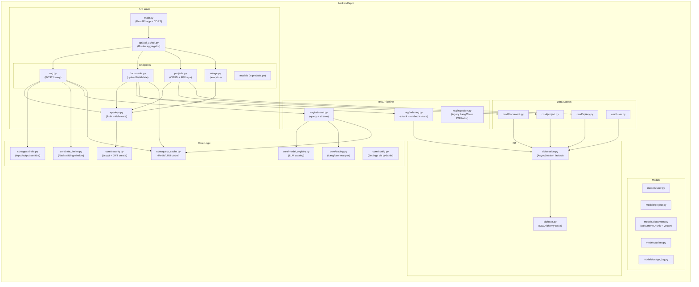

---

## 5. Authentication & Authorization Flow

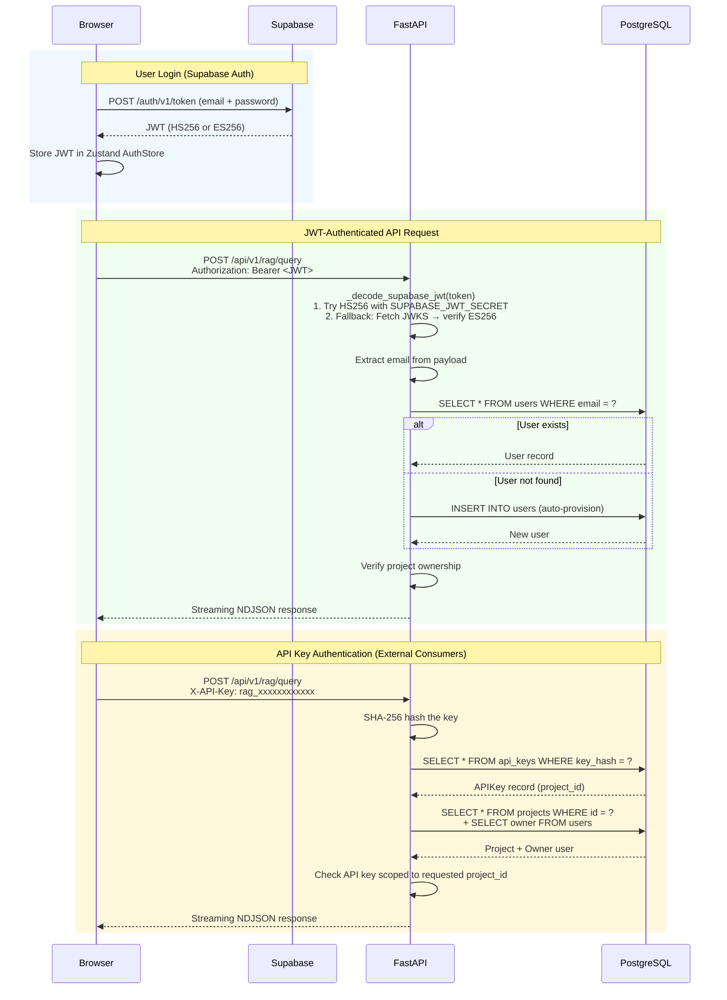

---

### Authorization Model

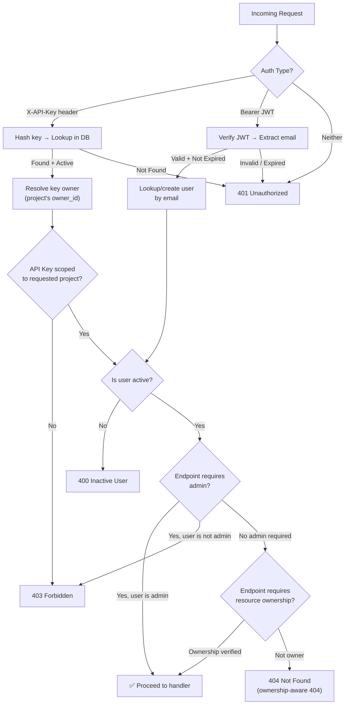

---

## 6. RAG Query Pipeline — Sequence Diagram

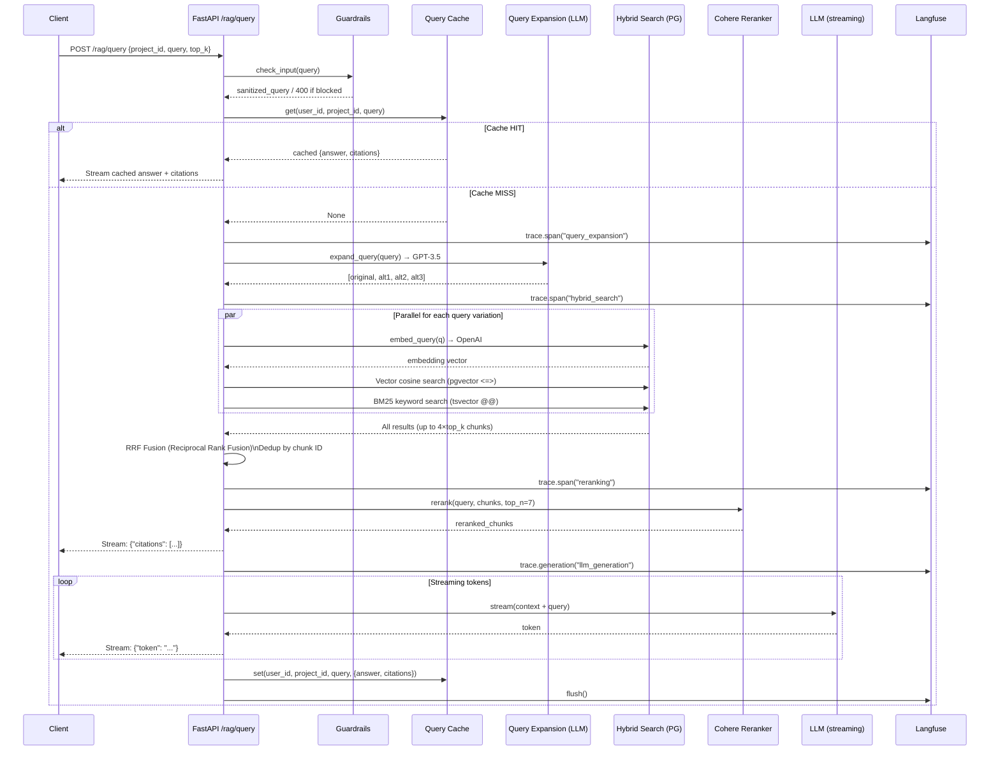

---

## 7. Document Upload & Indexing Flow

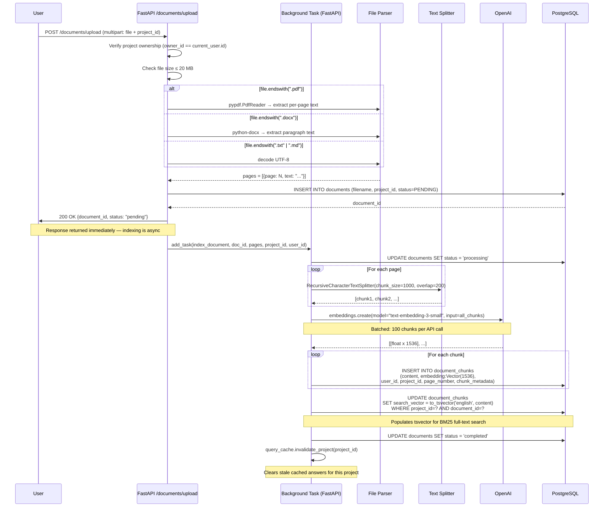

---

## 8. Data Model (Entity-Relationship Diagram)

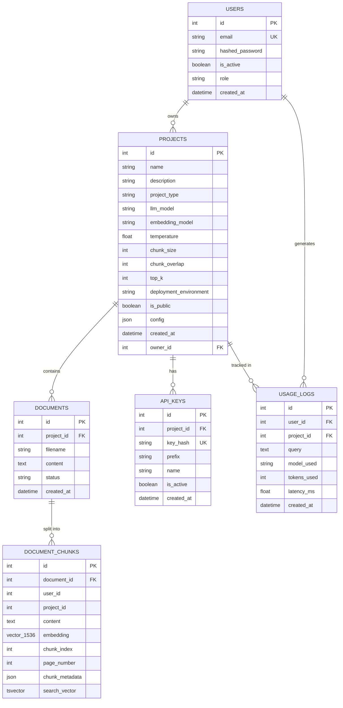

### Denormalization Note

`DOCUMENT_CHUNKS` intentionally stores `user_id` and `project_id` directly (denormalized from the `PROJECTS` → `USERS` relationship). This is a deliberate performance optimization: every retrieval query filters on `WHERE user_id = ? AND project_id = ?` without requiring any JOIN, reducing retrieval latency at scale.

---

## 9. API Surface Map

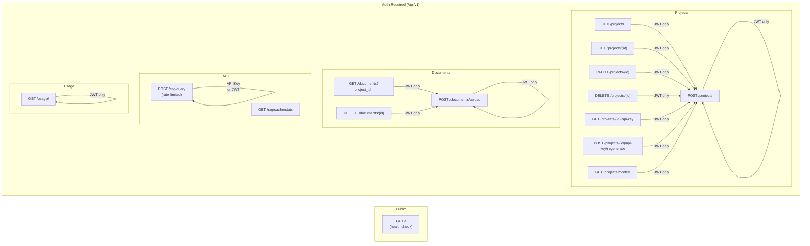

### Endpoint Reference Table

| Method | Path | Auth | Rate Limited | Streaming |
|--------|------|------|-------------|-----------|
| `GET` | `/` | None | No | No |
| `POST` | `/api/v1/projects` | JWT | No | No |
| `GET` | `/api/v1/projects` | JWT | No | No |
| `GET` | `/api/v1/projects/{id}` | JWT | No | No |
| `PATCH` | `/api/v1/projects/{id}` | JWT | No | No |
| `DELETE` | `/api/v1/projects/{id}` | JWT | No | No |
| `GET` | `/api/v1/projects/{id}/api-key` | JWT | No | No |
| `POST` | `/api/v1/projects/{id}/api-key/regenerate` | JWT | No | No |
| `GET` | `/api/v1/projects/models` | JWT | No | No |
| `POST` | `/api/v1/documents/upload` | JWT | No | No |
| `GET` | `/api/v1/documents` | JWT | No | No |
| `DELETE` | `/api/v1/documents/{id}` | JWT | No | No |
| `POST` | `/api/v1/rag/query` | JWT or API Key | ✅ 10/min | ✅ NDJSON |
| `GET` | `/api/v1/rag/cache/stats` | JWT | No | No |
| `GET` | `/api/v1/usage/` | JWT | No | No |

---

## 10. Infrastructure & Deployment Diagram

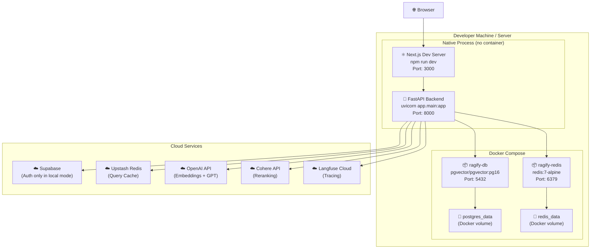

### Deployment Notes

- The backend and frontend are **not containerized** in the current `docker-compose.yml` — only infrastructure services (PostgreSQL, Redis) are.
- For production, the backend should be containerized and placed behind an Nginx/Caddy/Traefik reverse proxy for TLS termination.
- Alembic migrations must be run before the backend starts: `alembic upgrade head`

---

## 11. Frontend Architecture

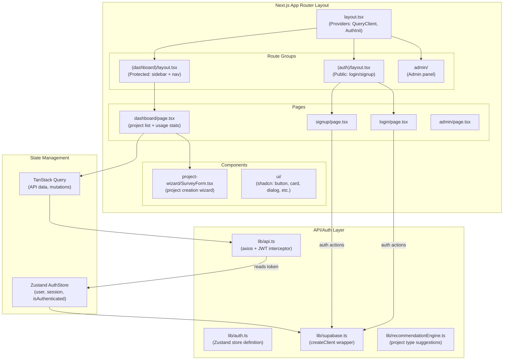

---

## 12. Caching Architecture

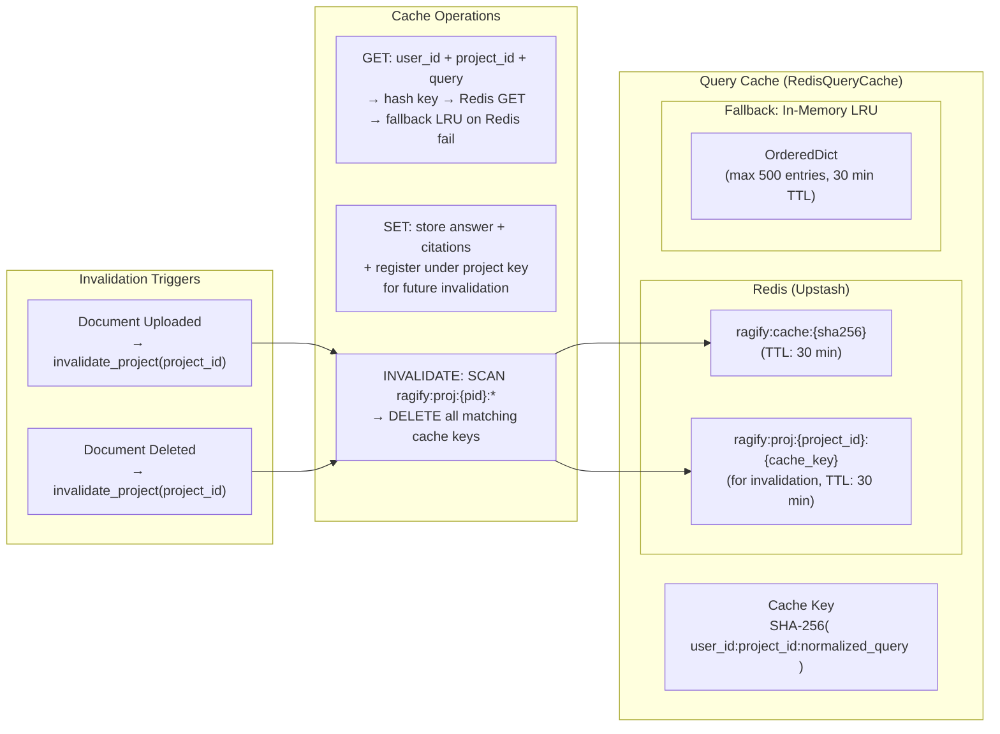

### Cache Key Design

The cache key is a SHA-256 hash of `"{user_id}:{project_id}:{normalized_query}"`. This guarantees:

1. **Cross-user isolation**: User A cannot read User B's cached answers
2. **Cross-project isolation**: Querying project 1 and project 2 with the same text produces separate cache entries
3. **Query normalization**: `query.lower().strip()` is applied before hashing — minor case/whitespace differences still produce cache hits

---

## 13. Multi-Tenancy Design

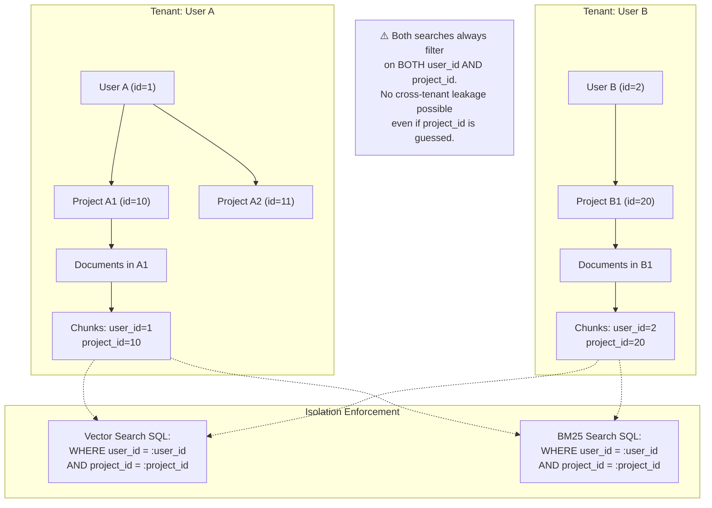

**Tenancy Isolation Layers:**

| Layer | Isolation Mechanism |
|---|---|
| Database | `WHERE user_id = ? AND project_id = ?` on every chunk retrieval |
| API | `project.owner_id != current_user.id` → 404 |
| Cache | Cache key includes `user_id` |
| API Keys | Key scoped to one project_id; verified in request |
| Supabase RLS | Row-level policies on projects/documents tables |

---

## 14. Data Flow: End-to-End Query

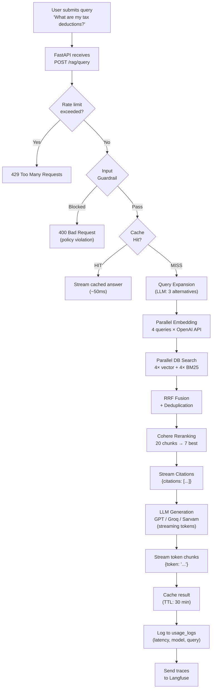

---

## 15. State Machine: Document Status

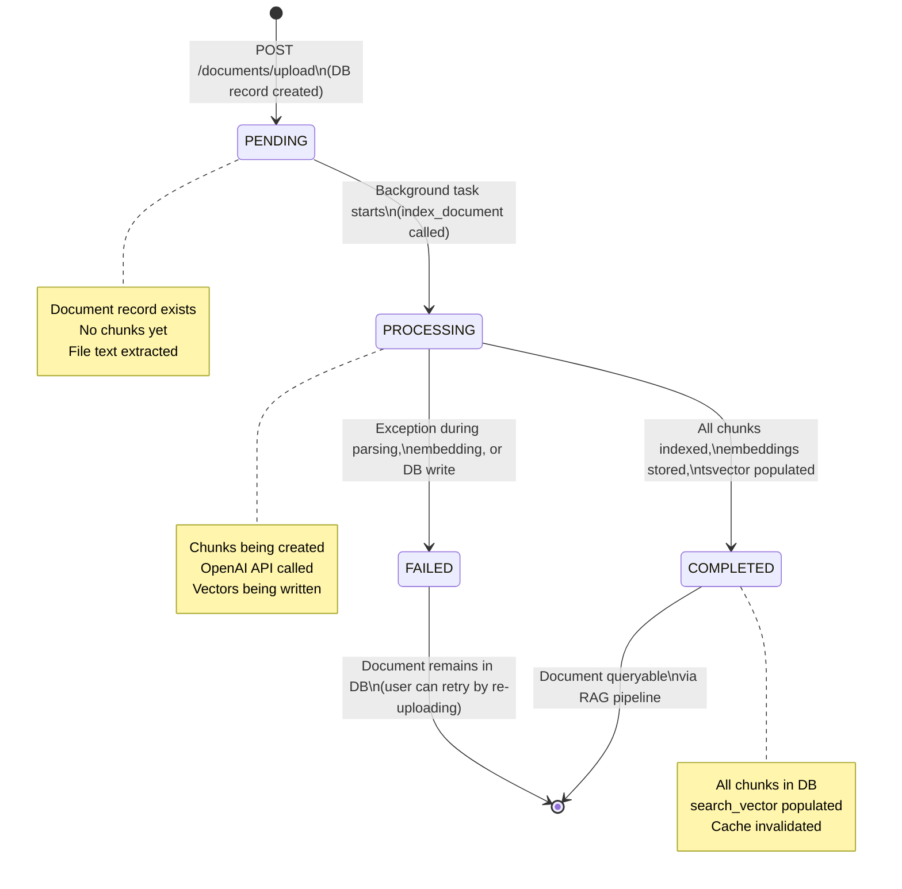

---

## 16. Key Design Decisions

### Decision 1: Denormalized `user_id` / `project_id` on Chunks

**Context:** High-frequency retrieval queries must filter by user and project.  
**Decision:** Store `user_id` and `project_id` directly on the `document_chunks` table rather than resolving them via JOIN (`document_chunks → documents → projects → users`).  
**Rationale:** At 10+ queries/second across many tenants, a 3-table JOIN on the hot retrieval path adds non-trivial latency. Denormalization avoids this entirely.  
**Trade-off:** Data duplication; `user_id` must be correctly set at write time and never changes.

---

### Decision 2: Active Implementation is `indexing.py`, not `ingestion.py`

**Context:** Two RAG implementations exist: `ingestion.py` (LangChain `PGVector` abstraction) and `indexing.py` (raw SQLAlchemy + OpenAI calls).  
**Decision:** `indexing.py` is the production implementation.  
**Rationale:** LangChain's `PGVector` abstraction hides metadata storage, page number tracking, and chunk structure. The raw implementation gives full control over `page_number`, `chunk_metadata`, `user_id`, and `project_id` columns.  
**Trade-off:** More code to maintain; relies on internal OpenAI SDK directly.

---

### Decision 3: Dual Auth (JWT + API Key) at the Dependency Level

**Context:** Two types of consumers — frontend users (JWT) and external developers (API Key).  
**Decision:** Both auth types are resolved in `deps.py` before the endpoint handler runs. The handler operates on a `User` object regardless of how auth was performed.  
**Rationale:** Endpoints remain auth-mechanism-agnostic. Rate limiting and guardrails work identically for both auth types.  
**Trade-off:** API Key auth resolves the project owner as `current_user`, which requires the API key's project ownership check to happen before the pipeline runs.

---

### Decision 4: Streaming NDJSON vs Single JSON Response

**Context:** LLM generation can take 3–15 seconds for complex queries.  
**Decision:** Stream LLM tokens as NDJSON (`application/x-ndjson`) — each line is a complete JSON object.  
**Rationale:** Users see the first tokens within ~1 second, dramatically improving perceived performance.  
**Format:**
```json
{"citations": [{"filename": "...", "page": 1, "snippet": "..."}]}
{"token": "Based on your "}
{"token": "documents, the "}
{"token": "answer is..."}
```

---

### Decision 5: Reciprocal Rank Fusion over Score Normalization

**Context:** Hybrid search produces two ranked lists (vector cosine scores and BM25 TF-IDF scores) that are not directly comparable (different value ranges and semantics).  
**Decision:** Use Reciprocal Rank Fusion (RRF) with `k=60`.  
**Rationale:** RRF only cares about relative rank position, not absolute score — making it robust even when the two search modalities produce incomparable raw scores.  
**Formula:** `RRF_score(doc) = Σ 1 / (k + rank_in_list)`

---

### Decision 6: Background Task Indexing

**Context:** Indexing a document (parsing → chunking → embedding → storing) can take 10–60 seconds for large PDFs.  
**Decision:** Use FastAPI `BackgroundTasks` — the upload endpoint returns `200 OK` immediately with `status: "pending"`, and indexing runs asynchronously.  
**Rationale:** Document upload should never block the HTTP response. Users can poll the document status to see when it's ready.  
**Trade-off:** Users may query a project immediately after upload and get no results (document not yet indexed). A status polling endpoint or WebSocket would improve UX.

---

*Report generated by GitHub Copilot Architecture Review — 7 March 2026*
